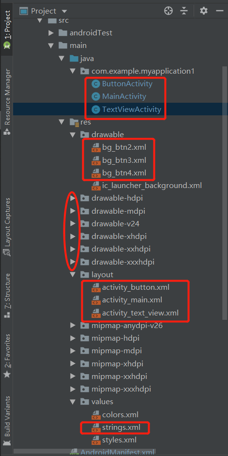
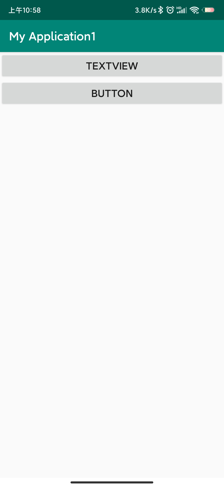
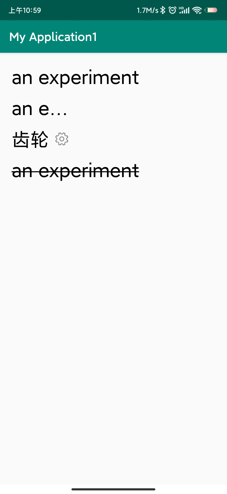
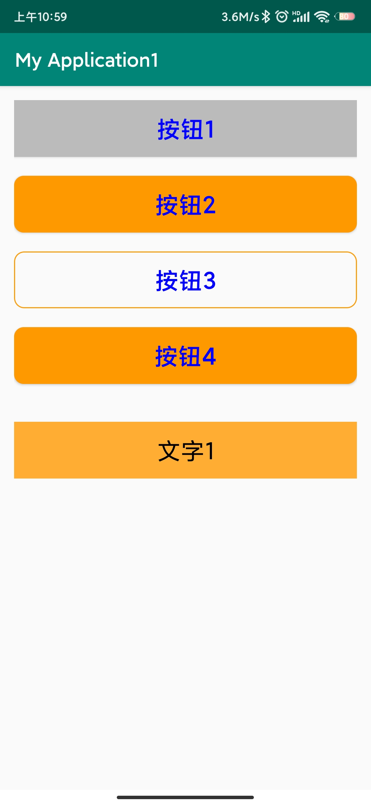

说明一下本项目。

相比于直接创建的空项目，本项目修改了一些东西

如上图中，首先是myapplication1中的三个java文件，都是activity，然后在drawable中的3个btn的xml文件，是设置按钮样式的。几个drawable的dpi中，是多种齿轮样式，用在textview界面的一个小icon，layaout中的三个xml是设置三个界面（主界面，textview界面，button界面）布局用的，最下面的strings.xml定义了一个常量，用于activity_text_view.xml文件引用。

主界面，text_view界面，button界面分别如下左起三图。

	
	
    

